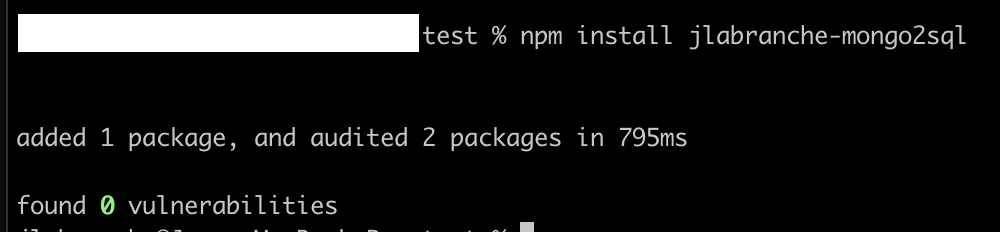
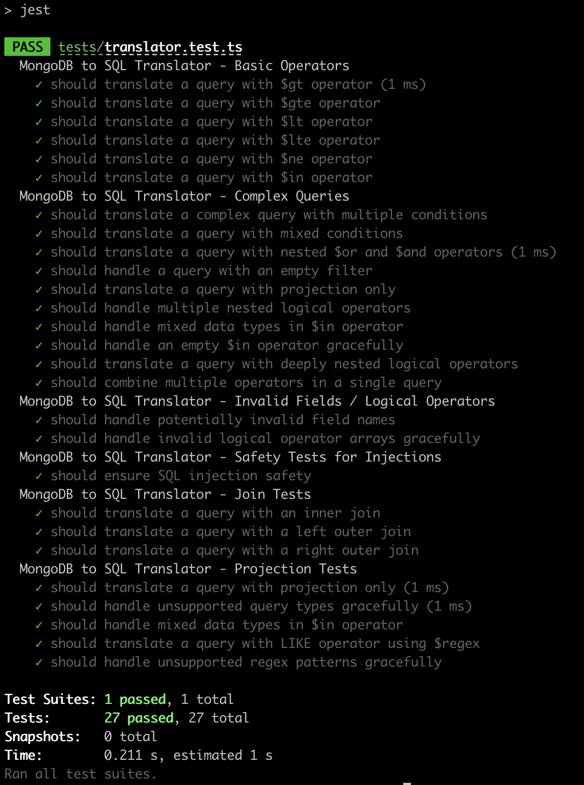

# # jlabranche-mongo2sql

## Overview

The NoSQL to SQL Translator is a TypeScript library that converts MongoDB queries to SQL queries. This project aims to bridge the gap between NoSQL databases and SQL databases by providing a tool to translate MongoDB queries into their SQL equivalents.

A library to translate MongoDB queries to SQL queries.


## Features

- Supports basic MongoDB operators like `$gt`, `$gte`, `$lt`, `$lte`, `$ne`, and `$in`.
- Handles complex queries with multiple conditions.
- Supports logical operators like `$or` and `$and`.
- Translates projection queries.
- Ensures SQL injection safety.
- Supports SQL joins (`INNER JOIN`, `LEFT JOIN`, `RIGHT JOIN`).
- Handles mixed data types in `$in` operator.
- Translates MongoDB `$regex` to SQL `LIKE`.
-- Gracefully fails on unsupported regex
- Gracefully handles unsupported query types.

## Installation

```sh
npm install jlabranche-mongo2sql

```


## Usage

```javascript
const { translateToSQL } = require('jlabranche-mongo2sql');

const mongoQuery = {
  collection: "user",
  filter: { age: { $gt: 30 } }
};

const sqlQuery = translateToSQL(mongoQuery);
console.log(sqlQuery);  // Outputs: "SELECT * FROM `user` WHERE `age` > 30"
```



## Tests

This library includes comprehensive tests to ensure the correctness and reliability of the translation from MongoDB queries to SQL queries. The tests cover the following scenarios:

- **Basic Operators**: Tests for basic MongoDB operators such as `$gt`, `$gte`, `$lt`, `$lte`, `$ne`, and `$in`.
- **Complex Queries**: Tests for complex MongoDB queries involving multiple conditions.
- **Invalid Fields / Logical Operators**: Tests to handle cases with invalid fields and logical operators like `$or` and `$and`.
- **Safety Tests for Injections**: Tests to ensure the translation process is safe from SQL injection attacks.
- **Join Tests**: Tests to verify the correct translation of MongoDB join operations to SQL joins (`INNER JOIN`, `LEFT JOIN`, `RIGHT JOIN`).
- **Projection Tests**: Tests to ensure MongoDB projection queries are correctly translated into SQL select fields.

Each test scenario is implemented to validate that the MongoDB queries are accurately translated into their SQL equivalents, maintaining the integrity and expected behavior of the queries.
